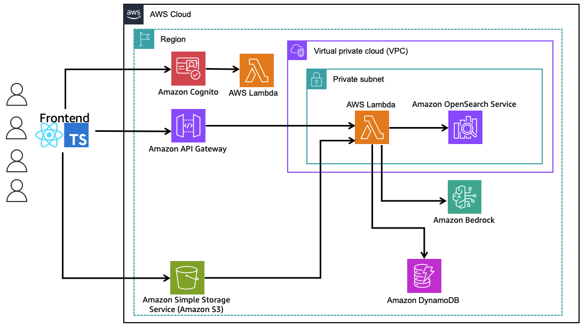

# JWT OpenSearch RAG Solution

This repository contains a sample implementation of a Retrieval Augmented Generation (RAG) application using Amazon OpenSearch Service and Amazon Cognito. It combines JWT-based authentication with efficient search capabilities provided by OpenSearch.

## Architecture Overview



This solution consists of the following components:

- **Frontend**: Single Page Application built with React + TypeScript
- **Backend**: Serverless architecture defined with AWS CDK
  - Amazon Cognito: User authentication
  - Amazon API Gateway: RESTful API
  - AWS Lambda: Business logic
  - Amazon OpenSearch Service: Document search
  - Amazon DynamoDB: Metadata management
  - Amazon S3: Document storage

## Key Features

- User authentication and JWT-based access control
- Document upload and management
- Natural language document search
- Chat interface for interactive search
- Multi-tenant data isolation

## Directory Structure

```
/
├── frontend/           # Frontend application (React + TypeScript)
├── infrastructure/     # Infrastructure code (AWS CDK)
└── sample-docs/        # Sample documents
```

## Prerequisites

- [Node.js](https://nodejs.org/) (v22 LTS or later)
- [AWS CLI](https://aws.amazon.com/cli/) (latest version)
- [AWS CDK](https://aws.amazon.com/cdk/) (v2.170.0 or later)
- [Docker](https://www.docker.com/) (latest version, installed and running, required for Python Lambda deployment)
- AWS account with appropriate IAM permissions
- Amazon OpenSearch Service service-linked role (see note below)

## Quick Start


### 1. Clone the Repository

```bash
git clone https://github.com/aws-samples/sample-multi-tenant-saas-rag-using-bedrock-and-amazon-opensearch-service-with-jwt.git
cd sample-multi-tenant-saas-rag-using-bedrock-and-amazon-opensearch-service-with-jwt
```

### 2. Deploy the Backend

```bash
cd infrastructure
touch .env
```

Make and edit the `.env` file with the values based on your environment:

```
CORS_ALLOWED_ORIGIN=http://localhost:5173
DEMO_USER_PASSWORD=<YourCustomPassword>
```

When setting your `<YourCustomPassword>`, please ensure it meets the following password policy requirements:
- Minimum length of 12 characters
- Contains at least 1 number
- Contains at least 1 special character
- Contains at least 1 uppercase letter
- Contains at least 1 lowercase letter

#### Amazon OpenSearch Service Service-Linked Role

Before deploying, ensure that the Amazon OpenSearch Service service-linked role exists in your AWS account. If you have never created a VPC domain or direct query data source through the AWS Management Console, this role might not exist.

To check if the role exists, run:

```bash
aws iam get-role --role-name AWSServiceRoleForAmazonOpenSearchService
```

If the role doesn't exist, create it manually:

```bash
aws iam create-service-linked-role --aws-service-name opensearchservice.amazonaws.com
```

For more information, see the [Amazon OpenSearch Service Developer Guide](https://docs.aws.amazon.com/opensearch-service/latest/developerguide/slr-aos.html#create-slr).

```bash
npm install
npm run cdk deploy
```

Note: We recommend using `npm install` instead of `npm ci` due to dependency issues with the `@aws/pdk` package.

After deployment completes, note the output values (API endpoint, Cognito User Pool ID, etc.).

### 3. Configure and Start the Frontend

```bash
cd ../frontend
touch .env
```

Make and edit the `.env` file with the values obtained from the CDK deployment:

```
VITE_API_ENDPOINT=https://your-api-id.execute-api.region.amazonaws.com/prod
VITE_APP_USER_POOL_ID=region_userpoolid
VITE_APP_USER_CLIENT_ID=your-app-client-id
```

```bash
npm install
npm run dev
```

The frontend application will be available at http://localhost:5173.

## Detailed Documentation

- [Frontend Setup](./frontend/README.md)
- [Infrastructure Deployment](./infrastructure/README.md)

## Security

This sample application implements the following security best practices:

- JWT-based authentication
- Enforced HTTPS communication
- IAM policies based on the principle of least privilege
- OpenSearch deployment within a VPC

> **Note:** This is a test solution with `selfSignUpEnabled = true` in Amazon Cognito. For production environments, consider disabling self-signup and implementing additional security controls.

## Multi-Tenant Sample Documents

The `sample-docs` directory contains four sets of documents with different topics for each tenant:

- **tenant-a**: Documents related to topic A
- **tenant-b**: Documents related to topic B
- **tenant-c**: Documents related to topic C
- **tenant-d**: Documents related to topic D

These sample documents can be used by each tenant user to upload from the frontend. Once uploaded, users can:

1. Ask questions about documents they've uploaded through the RAG chat interface
2. Try asking questions about documents uploaded by other tenants
3. Verify that only documents from their own tenant are referenced in responses

This demonstrates the multi-tenant data isolation feature, ensuring that each tenant can only access their own documents, even when using similar queries across tenants.

## Disclaimer

This code is provided as a sample and should undergo appropriate security review before use in production environments.

## License

This project is licensed under the [MIT License](LICENSE).